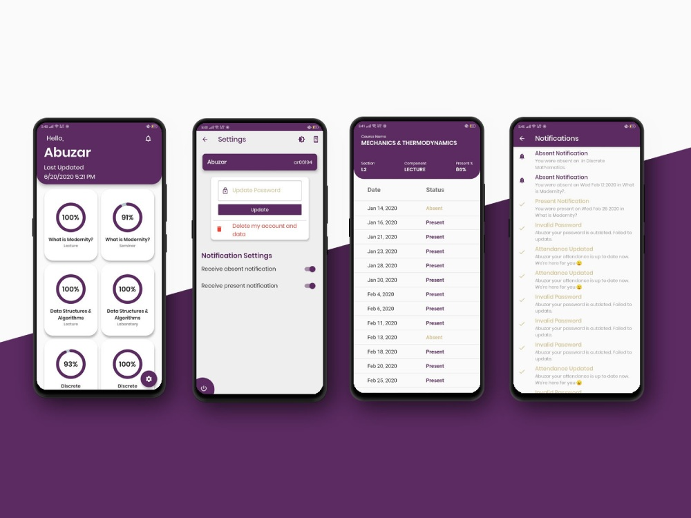
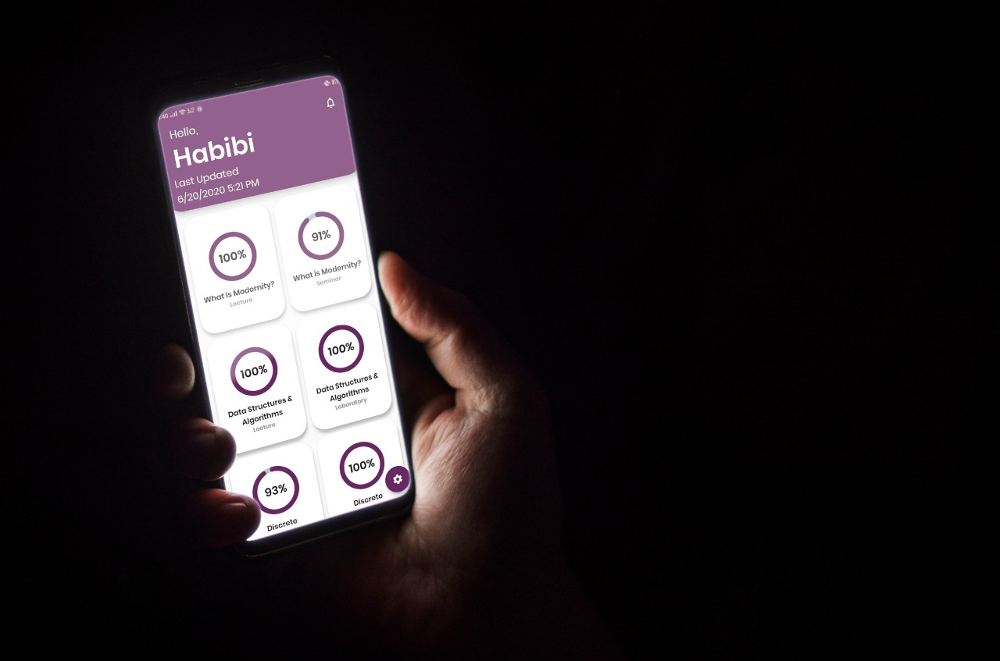

# Hazir App 
Hazir App was built for Habib University student body to help them track their attendance amidst severe attandace policies by the management.

Interesting, we built this behind the back of the management and reverse engineered the app to get the attendance data. We found a vulnerability in the attandance system and exploited it to get the attendance data.

## Features

- [x] Login
- [x] Register
- [x] Forgot Password
- [x] Reset Password
- [x] Logout
- [x] Change Password
- [x] Change Profile Picture
- [x] Change Username

## Tech Stack

- [x] Flutter
- [x] Dart
- [x] Firebase
- [x] Firebase Auth
- [x] Firebase Firestore
- [x] Firebase Storage
- [x] Firebase Cloud Functions

## Screenshots

